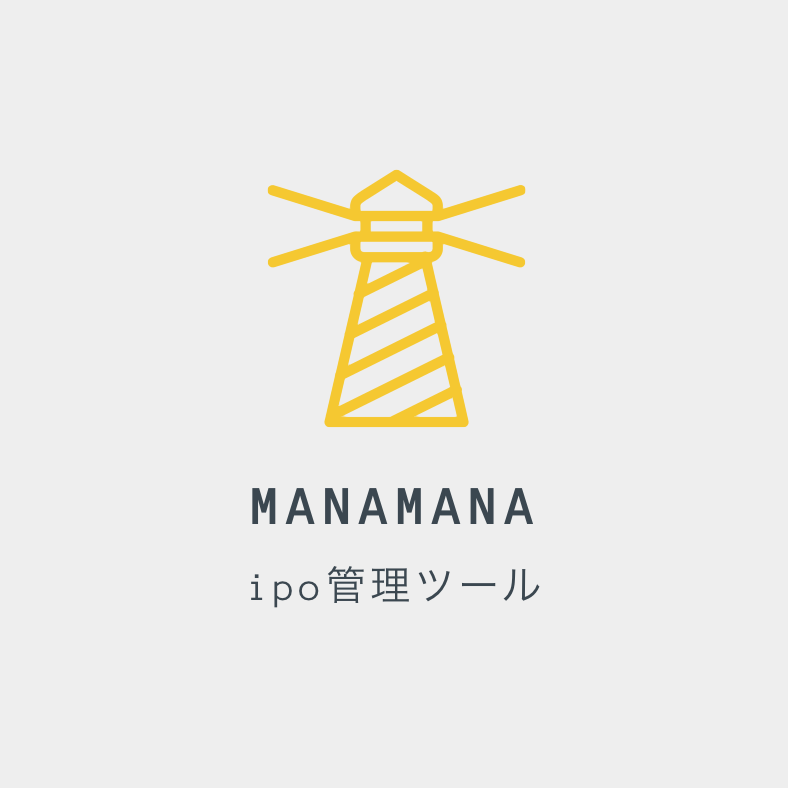
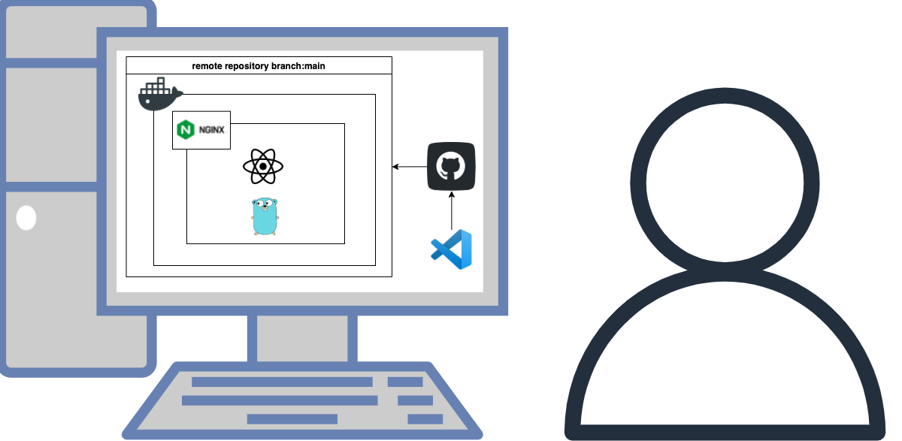

<h1>システム</h1>

 
 
<h1>インフラ構成図</h1>

 
 
<h1>使用技術</h1>

◯Go 1.15.14

◯React 17.0.2

◯nginx 1.21.4

◯Dcoker 20.10.10

◯Terraform v1.1.3

◯GitHub

◯Visual Studio Code

 
 
<h1>今後の展開</h1>
制作中です。 
 
ipo（新規公開株式）の購入意思表示をseleniumで行い、 
管理するシステムです。 
 
DBは必要かどうか判断してから導入しようと考えています。