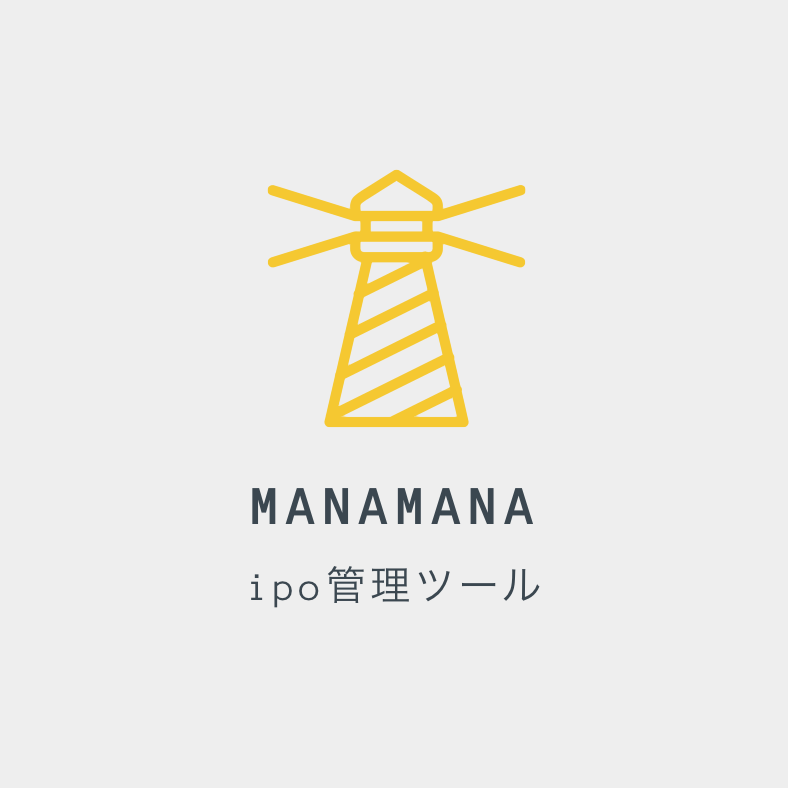
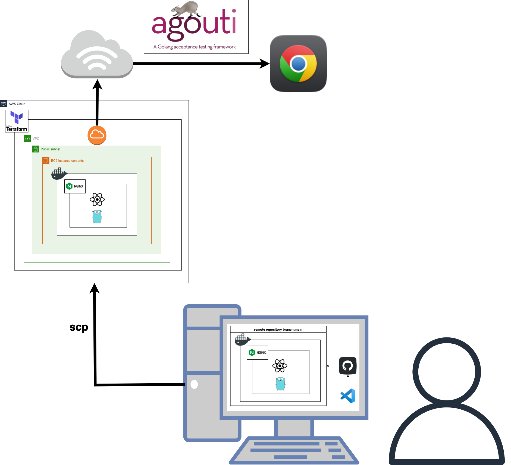
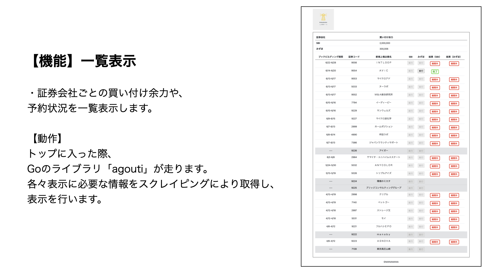
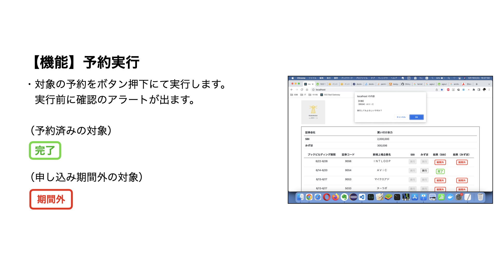

<h1>システム</h1>

 
 
<h1>インフラ構成図</h1>

 
 
<h1>使用技術</h1>

◯Go 1.15.14

◯React 17.0.2

◯nginx 1.21.4

◯Dcoker 20.10.10

◯Terraform v1.1.3

◯GitHub

◯Visual Studio Code

 
 
<h1>①どのような機能を</h1>
【機能概要】
 
ipo（新規公開株式）の自動申し込み、 
および現資産の確認・管理を行うシステムです。 
忘れがちなipoの申し込みと、 
資産運用の改善をこのアプリケーションで一括して行う事ができます。
 
 

 

 
 
【課題とその背景】 
課題として、 
◯SPA 
◯インフラのコード化 
◯GoとReactの使用 
を実現したいと思っていました。
 
 
背景として、 
日頃からこの様なシステムが欲しいと思っていましたが、 
代替となるものは見つける事が出来なかったです。 
また、今興味のある技術の学習を考えた時に、 
自分が欲しいと思うシステムを開発する事がモチベーションに繋がると考え、 
このシステムを作るに至りました。
 
 
<h1>②どのような技術を用いて</h1>

◯バックエンド：Go 1.17

（選定理由）
実行速度が速いとの事で選定しました。 
また、SPA形式でのアプリケーションの作成を考えていたので、 
バックエンドのAPIとして使用するのに相性が良いと考え選定しました。
 
 
◯FW：echo v4

（選定理由）
Ginと悩みましたが、
Ginよりも軽量かつ小・中規模のアプリケーションの開発に向いているとの事で、 
こちらを選定しました。 
また、情報ソースも多く、 
一見した時にコードの可読性が良かったのも選定理由の一つです。
 
 
◯ORM：Gorm

（選定理由）
保守性向上の為ORMの導入は元より考えていたので、 
情報ソースが多く可読性の良いこちらを選定しました。
 
 
◯OSS：agouti

（選定理由）
当初ブラウザのクローリングはSeleniumで行う予定でしたが、 
PythonやJavaの動作環境をその為だけに用意するのは保守性の面から鑑み、 
あまり妥当ではないと考え、 
Goで動作するこちらを選定しました。
 
 
◯フロントエンド：React 17.0.2

（選定理由）
Goと同様に実行速度が速いとの事で選定しました。 
また、レンダリングも速く、 
UXの面から鑑みてもこちらがフロントエンドに向いていると考え選定しました。
 
 
◯ライブラリ：axios

（選定理由）
SPAでアプリケーションを制作するにあたって非同期通信は必須となるので、 
こちらを選定しました。 
ajaxの使用経験はあったので、 
学習コスト自体は低かったです。
 
 
◯Webサーバーソフトウェア：nginx 1.21.4

（選定理由）
Apacheと違い、 
シングルスレッドでプロセスの処理を行う事ができ、 
負荷の増大に寄与せず、 
処理速度の維持が実現できるので、 
こちらを選定しました。
 
 
◯インフラ管理ツール：Terraform v1.1.3

（選定理由）
インフラの保守性の向上から選定しました。 
また、今後別のアプリケーションの開発を行う際に、 
類似した環境構築が容易に再現できる様になるので、 
導入するに至りました。
 
 
◯ツール：Dcoker 20.10.10

（選定理由）
開発環境構築の高速化、
およびローカル環境から本番環境への再現流用性の高さから選定しました。
 
 
<h1>③どのような工夫をして</h1>
【行動の背景】
 
UXの向上を鑑みた時に、 
SPA化が現状のベストプラクティスであると考え、 
それを実現する為に技術を選定していきました。
 
 
<h1>④どのような成果に繋がったのか</h1>
これまでは、 
自分の分かる範囲で使用経験のある技術を選定して開発を行なっていた事が多かったですが、 
今回はどれも使用経験の無い技術で、 
また、台頭間も無いモダンな技術もいくつか盛り込んでいるので、 
そもそもWeb上に情報ソースが少なく、 
開発中に問題が起きた際に解決するまでに時間が掛かってしまう事態が散見されました。
 
 
成果として、 
まだ開発中の段階ではありますが、 
自分の欲しい機能と使いたかった技術を盛り込み、 
形にする事が出来てきたので、 
更なる改良・改善を続けていきたいと思います。